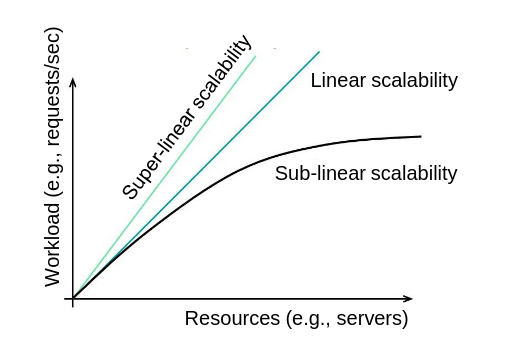
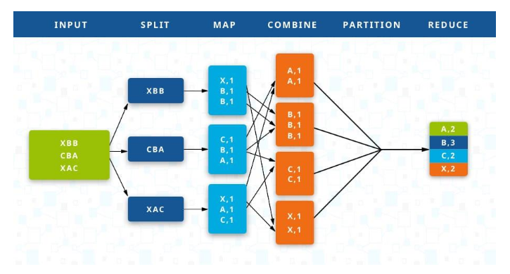

# Cloud Introduction

## Importance of Cloud

- 4.5 billion internet users
- Digitalization of society and industries
- Fast dissemination of new techs
- Easy, fast and cheap exposure to new trends available for everyone
  - Accelerators
  - Fast network interconnects
  - Latest storage technologies

## Cloud providers continue the full stack

- Hardware (influencing the design)
- Software (change or customize)
- New programming methodologies/paradigms (introduce/popularize)
- Application design and implementation (revolutionize)

## Challenges and focus

- Difficuties in first year: network, rack failures, router reloads, etc.
- **Reduction of cost**
- Worries: **privacy** and **security**
- Focus on **data processing**

## Distributed Computing Challenges

### Scalability

- More servers for independent parallel processing
- Ideal (Linear scalability): N more servers -> N more users, hard to achieve

  - overheads and sync
  - hotspots
  - Amdahl's Law: straggler (slow running task) server limits the speedup
  - Partition data and compute

  

- Scaling computation: data-intensive apps
  - Task/data-parallel processing
  - Frontend aggregation
  - Backend partial responses
    

### Fault Tolerance

- Failure is common case
- Replicate for redundancy (full replication is too expensive)
- Mask failures and recover
- Replication (consistency issues) or Re-compuation (stateless, data lineage): depends on costs

### High Availability

- Operate 24/7
- Downtime: bad experience, lost revenue (~5600$/min)
- SLAs
- Eliminate single points of failure
- Reliable crossover
- Efficient monitor and detect failures

> Example: 99.99% availability -> 52 minutes downtime/year -> $300,000

### Consistency

- across multiple servers
- Two main choices:
  - Strongly consistent operations (cost of additional latency)
  - Inconsistent operations (better performance/avaliability, harder to write/reason about)
- Many apps (e.g Gmail): eventual
- Modern data analytics: strong consistency

### Performance

- Low latency, high throughput
- Affects revenue (drop in sales, traffic)
- Tail latency: the last 0.x% of request latency distribution graph
  - Average latency not enough at scale
  - Amplified by scale due to fan-outs (microservices, data partitions)
  - Overall latency >= latency of the slowest component
  - Example: servers with 1ms average but 1sec 99%ile latency
