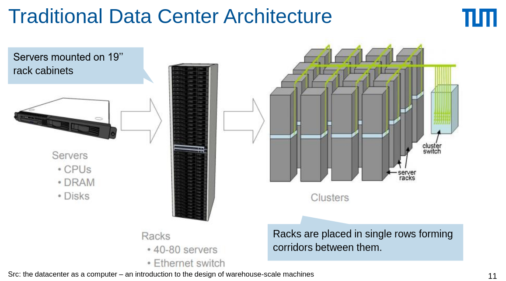

# Data Centers (DC)

A physical facility that enterprises use to house computing and storage infrastructure. in a variety of networked formats

- Power
- Cooling
- Shelter
- Security

## Modern DC for the Cloud architecture

- Geography
  - Two or more regions
  - Fault-tolerant from complete region failures
  - Set of DCs within a metropolitan area
- Availability Zones (AZs)
  - One or more DCs per AZ
  - One or more AZs per region
  - Independent power, cooling, and networking
  - Inter-AZ latency < 2ms
  - Fault-tolerant from DC failures

## Datacenter Architecture

### Modern DC

- Shipping containers packed with
  1000s servers each
- Replace whole containers for repair

## Operating Cost

- Power Usage Effectiveness (PUE) = Total Facility Power / IT Equipment Energy
- Total Facility Power = IT Equipment Energy + Others (cooling, lighting, switch etc.)

### Achieving PUE

- Location of the DC – cooling and power load factor
- Raise temperature of aisles
- Reduce conversion of energy
- Go to extreme environments: Arctic circle (Facebook)
- Reuse dissipated heat

## Evolution of datacenter design

- Gen 1. Colocation (1998-2005, 2.0+ PUE)
- Gen 2. Density
- Gen 3. Containment (2009, 1.2-1.5 PUE)
- Gen 4. Modular
- Gen 5. SW Defined
- Gen 6. Scalable form factor (2017)
- Gen 7. Ballard (2018, 1.15-1.18 PUE)
- Gen 8. Rapid deploy datacenter (2020)
- Gen X. Project Natick (future, <1.07 PUE)

## Datacenter Challenges

- Cooling
- Energy Proportional Computing
  - Average real world DC waste 2/3+ of their energy
  - Energy consumption is not proportional to the load: except for the CPU
- Servers are idle most of the time
  - Non-virtualized: 6-15%
  - Virtualized: boost up to 30%
  - Trend: resource disaggregation (pooling, dynamic allocation)
  - Hyper-scale system management software
    
- Efficient monitoring
  - Cluster management
  - To meet SLOs
- Managing scale and growth
  - Azure: 4M servers globally
- Network at scale
  - Mess of hardware (cable)
  - Software Defined Networking (SDN)

## Cloud Computing

- Computing as a Service: reserve/rent from vendors
- Fine-grained pricing model
  - By time or I/O
  - Pay as you go (pay for only what you use)

## Cloud service models

- Infrastructure as a Service (IaaS)
  - Rent HW, VMs, storage, network etc.
- Platform as a Service (PaaS)
  - Dev denvironment (e.g Google App Engine)
- Serverless/Function as a Service (FaaS)
  - Overlap with PaaS: vendors provide setup, capacity planning and server management etc.
- Software as a Service (SaaS)
  - Software applcation (handles by vendor, e.g Microsoft 365)
