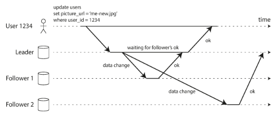
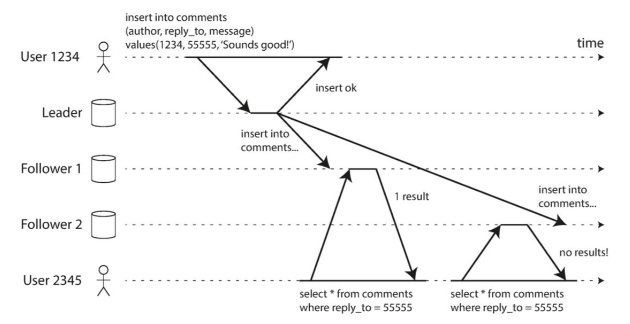
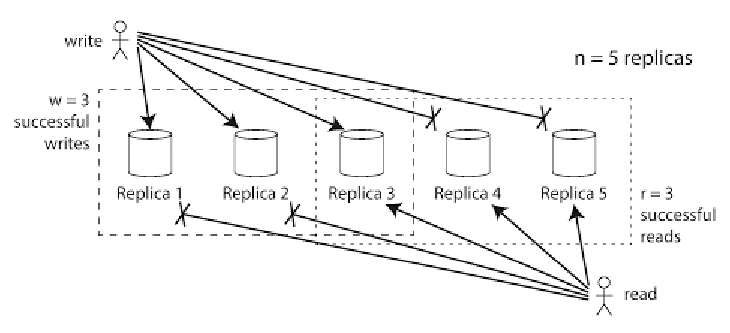

# Distributed Data: Replication

- Reason
  - Scalability
  - Fault Tolerance
  - Tail Latency (geographically close)

## Replication

Same data on different nodes (potentially different locations)

- Redandency
- Reduced latency
- Increased read throughput (more machines)
- Always beneficial and easy for read-only workload

### Challenges: data changes

- Leader replica (how many) or not
  - Requests are sent to leader
  - Followers update applying replication log from leader
  - Read from any node
- Sync/async propagation of updates
- Handle failed replica (Leader/Follower)

### Synchronous Replication

Wait: Leader report success to user after followers have confirmed write.

- Follower has up-to-date version of data
- Unable to respond if a follower does not respond

### Asynchronous Replication

No wait: Leader report success right after sending update to followers

- High Aavailability
- Weakened Durability: data loss when node with latest data crashes



> - Follower 1 is sync, Follower 2 is async.
> - Together the systems is not fully synchronous, reducing response time.

### Setting up new Followers

Copying data is not sufficient: clients are constantly writing.

1. Take consistent snapshot of Leader
2. Follower gets Leader's replication log since the snapshot
3. Follower has processed the backlog (caught up)

### Handling node outages/failures

Any node can go down

- Follower failure: catch-up recovery
- Leader failure: failover (downtime), promote new Leader and reconfigure

### Implementation of Replication Logs

- Statement based replication: every write request (SQL Statement) is logged

  `UPDATE users SET email = 'new@email.com' WHERE id = 1;`

- Write-ahead log (WAL): log happens ahead of applying. Physical log, works are physical storage level, binary format.

```shell
  // WAL entry might look like this (simplified):
  LSN:1234 XACT:5678 MODIFY BLOCK:789 OFFSET:120
  DATA:<binary data representing the actual page changes>
```

- Change data capture (CDC) based replication – logical log: at the granularity of rows

  - Easier for extenal use, run on different databases

```sql
-- Source database has this table
CREATE TABLE users (
    id INT,
    name VARCHAR(50),
    email VARCHAR(100)
);

-- When this update happens:
UPDATE users SET email = 'new@email.com' WHERE id = 1;

-- CDC captures and produces a change event like:
{
    "type": "UPDATE",
    "table": "users",
    "before": {
        "id": 1,
        "email": "old@email.com"
    },
    "after": {
        "id": 1,
        "email": "new@email.com"
    },
    "timestamp": "2024-02-14 10:00:00"
}
```

- Trigger-based replication (done in Application layer)
  - Trigger: special procedure that is run when a certain event occurs
  - One implementation of CDC

### Problems with Replication Lag

- Eventual consistency

  - Inconsistency results at the same time
  - No limit how far a replica can fall behind.

- Read your own writes: After a user writes, they should be able to immediately see that change in their subsequent reads.
  - Read-after-write consistency
- Monotonic reads: If one user makes several reads in sequence,
  they will not read older data after previously
  reading newer data. (e.g enforcing user to read from the same node)

  

### Multi-Leader Replication

- Single-leader: Bottleneck is that all writes go through it (low fault tolerance)
- Multi-leader: Improved fault tolerance and performance
- Conflict resolution: write
  - Synchronous conflict detection
  - Conflict avoidance: writes for a particular record go through the same leader
  - Converging to a consistent state:
    1. Last writer wins (LWW)
    2. Application decides


### Leaderless Replication

- Replicas directly accept writes from clients
- Resurrected by Amazon Dynamo
- No failover when a node fails
- A client writes and reads from multiple nodes
  - Version number for newer value detection

#### Node catch up missed writes

- Read repair: client detects stale response and writes the correct value
- Anti-entropy process: a background checks for inconsistencies and fixes them (order not preserved)

#### Quorums for reading and writing

If there are `𝒏` replicas, every write must be confirmed by `w` nodes to be considered successful, and we must query at least `r` nodes for each read.

- W/R request are still sent to all nodes, `w/r` determines how many nodes we wait for
- Quorum reads and writes
- Up-to-date read: `r + w > n` (We can always read from some node that was/written has the latest data)
- With (3,2,2) we can tolerate 1 node failure, with (5,3,3) we can tolerate 2 nodes
  

#### Limitations of Quorum Consistency

Edge cases:

- Two writes occur simultaneously;
- Write happens at the same time as a read;
- Write succeeded on some replicas but failed on others and overall succeeded on less than w nodes;
- Node carrying a new value fails, and its data is restored from a replica carrying an old value

#### Sloppy Quorums with Hinted Handoff

- Sloppy quorum: the writes and reads still require `w` and `r` successful responses, but those may be by nodes that are not the designated “home” nodes for a value.
- Hinted handoff: Once the network interruption is fixed, any writes that one node temporarily accepted on behalf of another node are sent to the appropriate “home” nodes. This is called the hinted handoff.
- Increase write availability and durability (write won't get lost)
