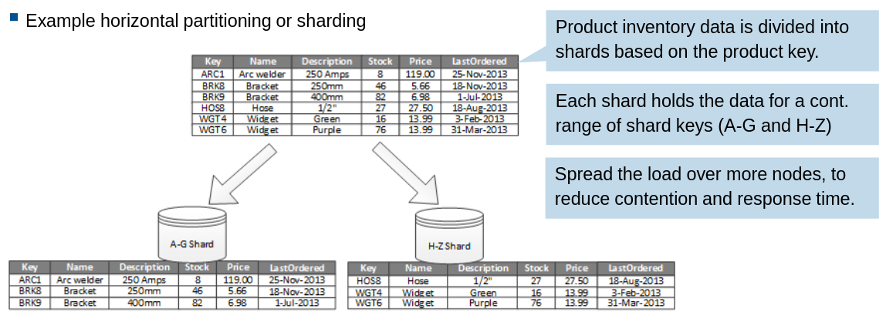
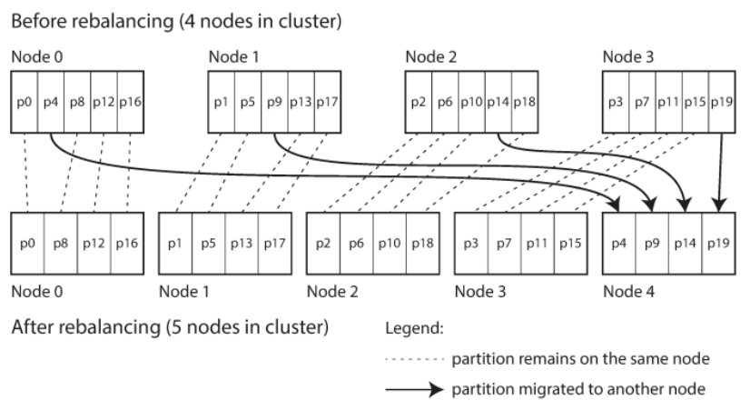
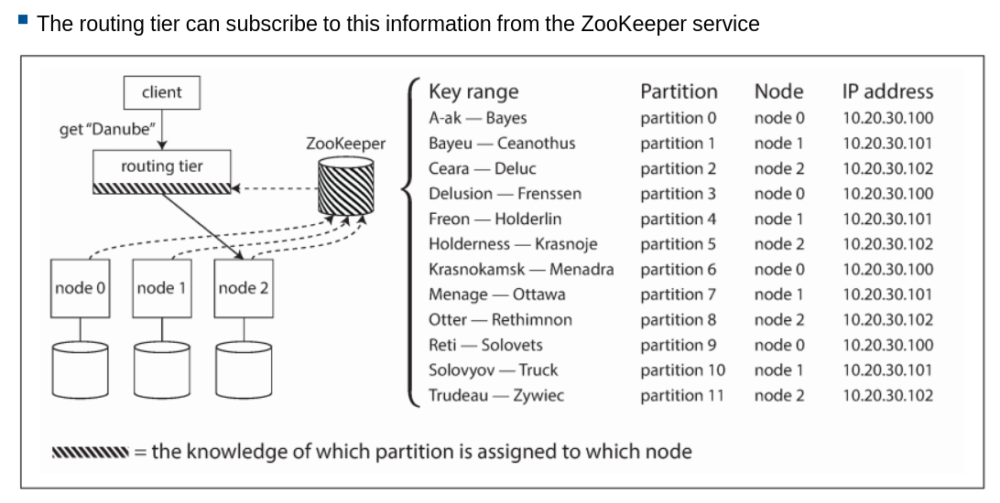
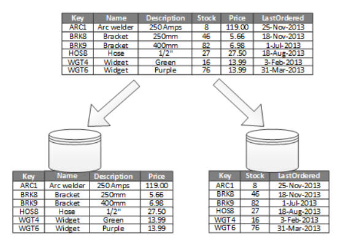
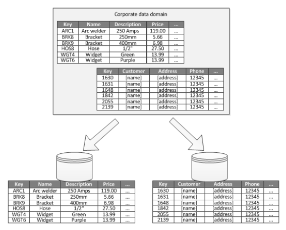

# Distributed data: Partitioning

Big dataset splited into smaller datasets (nodes). A piece of data belongs to exactly one partition.

> Called differently in different databases: shard, region, table, vnode, vbucket, etc.

- Reduced latency for analytics
- Improved Availability (No single point of failure)
- Improved Scalability (Different partitions can be on different nodes in shared nothing)
- Improved Performance (Operations on smaller datasets, parallel)
- Improved Security (Separate non-sensitive data from sensitive data)
- Better customization

> Can combine both replication and partitioning

## Horizontal partitioning (Sharding)

- Each partition is a subset of the data.
- All partitions have the same schema.
  

### Choice of Sharding Key

- Goal: Even distribution of data and load (not necessarily same sizes)
- **Skewed partition**: more data or queries (partitioning scheme)
- **Hotspot**: disproportionately high load partition (actual partition)

#### Strategies

- **Key range**: continuous range of keys to each partition, not necessarily evenly spaced, because data may not be evenly distributed.
  - (+) Range scan fast and easy: sorted
  - (+) Can fetch several related records in one query
  - (-) Hotspot: certain access patterns
- **Hash of key**: hash a key to determine partition, a range of hashes to each partition.
  - (+) Skew and hotspot: rare
  - (-) No efficient range queries

### Rebalancing partitions

Not necessary because of wrong partition, might also be because of cluster increase

- Hash mod N: bad
  - If #node N changes, most of the keys will be moved from one to another node
- #Partition >> #Node: good
  - Less data to move when a node is added/removed (no hash mod N)
- Splitting in 2 when size limit exceeded: dynamic partitioning
  - Applicable with range/hash partitioning
- Ensure proportional load: fixed number of partitions per node

### ZooKeeper

## Vertical partitioning

- (+) Reduced I/O and performance cost when fetching frequently accessed items (columns/properties).
- (+) Slow moving (infrequently changed) data cab be sperated (cached) from dynamic data
- (+) Separate sensitive data
- (+) Suited for column-oriented data stores

## Functional partitioning

Reduce data access contention across different parts of the system.

### Examples

- Production info and customer info are splited into 2 different partitions.
  
- Seperate read-write data and read-only data

## Partitioning for scalability

- Analyze the application's **access patterns**
  - Result set of queries
  - Access frequency
  - The inherent latency: minimum, unavoidable delay (physical/architectural)
  - Server-side compute processing requirements
- Determine current/future scalability targets (data size, workload etc.)
  - Choose the right shard key
  - Make sure each node has enough resources (storage, compute, network bandwidth etc.)
- Monitor
  - Distribution of data, performance of partitions
  - Rebalance if necessary

## Partitioning for query performance

- Smaller data set
- Running parallel queries
  - Merge results
  - No merge needed: fastest query wins
- Monitor: identify slow, fast and frequently executed queries -> partition the slow data

## Partitioning for better availability

- Identify critical data
  - Separate highly available partition, management and monitoring
  - Replicate critical data (potentially consistency issues)
- Individual partitions management
  - Independent recovery
  - Scheduled maintenance at off-peak hours (geographically partitioned)

## Others

- Document-partitioned index (local index)
- Term-partitioned index (global index)
- Materialized views: summarize data, faster queries
- Parallel query execution
