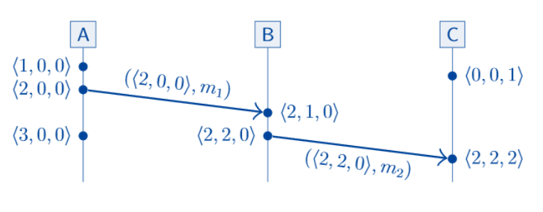

# Distributed System Models

## Reliable cloud application

1. Identify workloads and their usage requirements

2. Identify critical components and paths

3. Establish availability metrics

- Mean time to recovery (MTTR) and mean time between failures (MTBF)
  - Determine when to add redundancy
  - Determine SLAs

4. Define the availability (=uptime) targets: SLO and SLA

5. Failure mode analysis

6. Redundancy plan

7. Design scalability and load balancing

8. Implement Resiliency strategy

9. Manage the data: store, backup, recovery plan and replicate

10. Monitor and fault recovery

## Fault Tolerance

### Terminology

- Failure: system as a whole is not working

- Fault: some part of the system is not working

  - Node fault: crash(-stop/-recovery), deviate from algo
  - Network fault: dropped/delayed messages

- Fault tolerance: system as a whole continues working despite faults (a max. #fault assumed)

- Single point of failure (SPOF): node/network link whose fault leads to a failure

### Failure detectors

- Failure detector: Algorithm that detects whether a node is faulty
- Perfect failure detector: labels a node as faulty <=> it has crashed
- Impl: send message, await reponse, label crashed if no reply within timeout
- Problem: cannot differentiate between crashed, temp unresponsive node, lost and delayed message
- Stop sending requests to a dead node
- Promote new Leader if the current one is dead

### Unreliable components (Network)

System may suffer partial failures, machines have unreliable clocks, truth is defined by majority (quorum)

- Short Timeout
  - (+) Detects faults faster
  - (-) Might declare a node dead prematurely and case a domino

## Models of distributed systems

### System models

Specify the assumptions about faults may occur

#### Network behavior

- No network is perfectly reliable: unplug, DoS attack etc.
- Point-to-point communication

  - Reliable (perfect) links: received <=> sent, may be reordered
  - Fair-loss links: msg may be lost, duplicated, reordered, eventually get through
  - Arbitrary links (active adversary): malicious adversary interfere (spy, modify etc, worst case scenario)

#### Node behavior

Each node executes an algorithm of one of the following:

- Crash-stop
- Crash-recovery (in-memory state lost)
- Byzantine: arbitrary behavior

> A node is called correct when not faulty

#### Timing behavior

1. Synchronous: latency <= an upper bound, nodes execute algorithm at a known speed
2. Partially synchronous: async for a finite time, otherwise sync
3. Asynchronous: no timing guarantees at all

- Violation of synchrony in practice
  - Predictable latency (msg loss, congestion/contention, network/route reconfig)
  - Predictable speed of node (scheduling issues, stop-the-world GC, PF, swap, thrashing)

> RTOS provides scheduling guarantees, not used by most distributed systems

### Unreliability of clocks

- Why measure time
  - Scheduler, timeout, failure detector, retry timers
  - Performance measurement
  - Log files
  - Data with time-limited validity
  - Order of events

#### Physical clocks

Actual times elapsed. Quartz clocks, atomic clocks (TAI).
May be inconsistent with causality (drift, different speed etc)

- Leap seconds: sync UTC and TAI
- NTP and PTP: send requests to server to correct clock skew

```c
clock_gettime(CLOCK_REALTIME); // System clock in Linux
clock_gettime(CLOCK_MONOTONIC); // Monotonic clock in Linux
```

```java
// BAD
// System clock (Time-of-day): ajusted by NTP
long startTime = System.currentTimeMillis();
doSomething(); // NTP may adjusts the clock during this time
long endTime = System.currentTimeMillis();
long elapsedMillis = endTime – startTime;
// elapsedMillis may be negative!

// GOOD
// Monotonic clock: absolute elapsed time
long startTime = System.nanoTime();
doSomething(); // Not affected by NTP
long endTime = System.nanoTime();
long elapsedNanos = endTime – startTime;
// elapsedNanos is always >= 0
```

- Confidence interval
  - Uncertainty: drift, server's uncertainty, network RRT
  - Example: 90% confident that the time now is between 10.3 and 10.5 seconds past the minute
  - Most systems don't expose this uncertainty (except for Google TrueTime API: [earliest, latest])

#### Logical clocks

Count number of **events** occurred. Capture causal dependencies.
e1 -> e2 (causally precedes) => T(e1) < T(e2) (e1 happened before e2)

- Lamport clocks: each event has a timestamp
- Vector clocks: detect concurrent events
  - Each Node/Process maintains its own vector of timestamps
  - On event, the node increments its own timestamp in its vector
  - Current vector is attached to each message
  - Recipient merges message vector into its own vector
    
  - <2, 2, 0> represents first 2 events on A, first 2 on B, no on C
  - <a, b, c> causally precedes <d, e, f> if a <= d, b <= e, c <= f and at least one is <
