# Broadcast protocols

Broadcast/multicast is a group communication

- One node sends a message, all nodes in the group deliver it
  > We can have different message propagation strategies, as long as every node delivers the message in the end, it's a broadcast. Example: m2 is received first but cannot be shown to the application (delivered) yet because m1 is not delivered yet if we need to ensure causality m1 -> m2
- Protocol layer: message transmitting control
- Application layer: e.g a chat application
- Send: a msg os intended to transmitted from one node to another
- Receive: a msg is arrived but held before delivering. A node does not get to choose choose if to receive a msg or not, but it can choose to deliver it or not.
- Deliver: the msg is delivered from protocol layer to application layer after ensuring conditions like causual ordering
  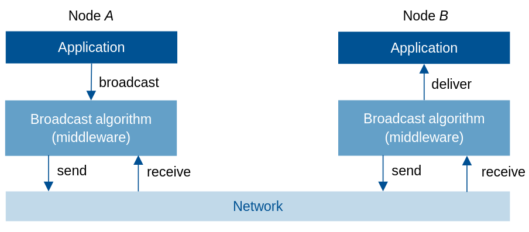

  > Might buffer/queue msg before delivering to application

- Types (System model):

  - Best-effort broadcast: Transmission speed, network delay, packet loss are not garanteed to be avoided
  - Reliable: non-faulty nodes retransmit every dropped msg

- Terminology:
  - Causally preceding <=> happens-before
    > Event e1 happens before e2 is denoted as e1 -> e2
    > 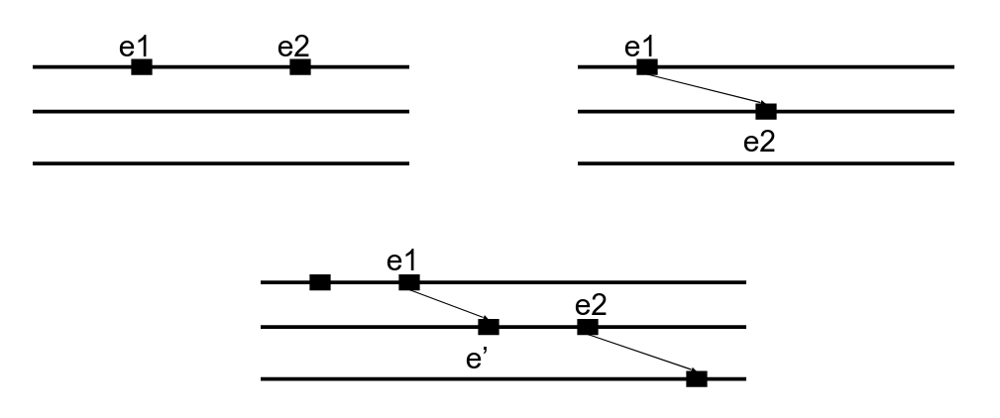
    > e' -> e2
    - Formally, causality is determined using **vector clocks**. e1 causally precedes e2 if v(e1) < v(e2).
    - Concurrent events are those whose vector clocks cannot be compared.
  - broadcast(m): the event of sending message m, not the whole broadcast process

## FIFO Broadcast

If broadcast(m1) -> broadcast(m2), both are sent by the **same node**, **all nodes** must deliver m1 before m2.

> Not all nodes must deliver **all messages** in the same order

- An example of a FIFO broadcast
  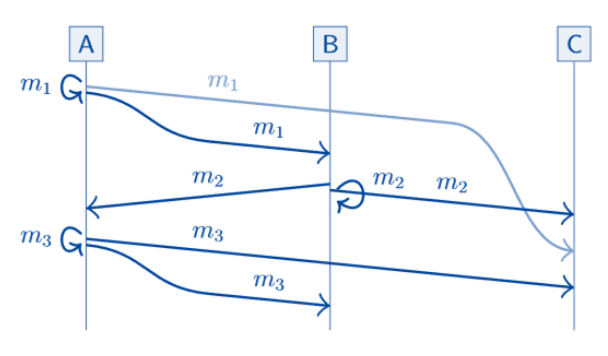
- Other possible orderings: blue, green and red and any of the combinations are valid FIFO broadcast, because delivery order m1 -> m3 is ensured.
  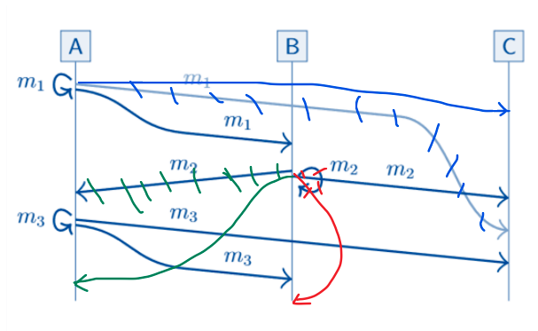
  > Endpoint of arrow is the time of delivery

## Causal Broadcast

If broadcast(m1) -> broadcast(m2), **all nodes** must deliver m1 before m2.
Different from FIFO: m1 and m2 can be sent by **different nodes**.

> Not all nodes must deliver **all messages** in the same order (same as FIFO)

Here the definition is actually a little bit tricky, it is about whether we want to enfore a Causal Broadcast given some conditions like m1 is sent by A and m2 is sent by B, broadcast(m1) -> broadcast(m2), or to inspect if a execution is a Causal Broadcast. Both are valid.

- An example of latter definition
  - Question: Is this a Causal Broadcast?
  - Answer: Yes. We can see broadcast(m1) -> broadcast(m2), broadcast(m1) -> broadcast(m3), and no causality between broadcast(m2) and broadcast(m3). So we check if all nodes deliver m1 before m2 and m3. Yes, they do. So this is an example of Causal Broadcast.

- A subset of FIFO broadcast

## Total Order Broadcast (Atomic Broadcast)

All nodes must deliver all messages in the same order, no matter what order it is. Causal order does not have to be preserved.

- Example: (m1, m2, m3)
  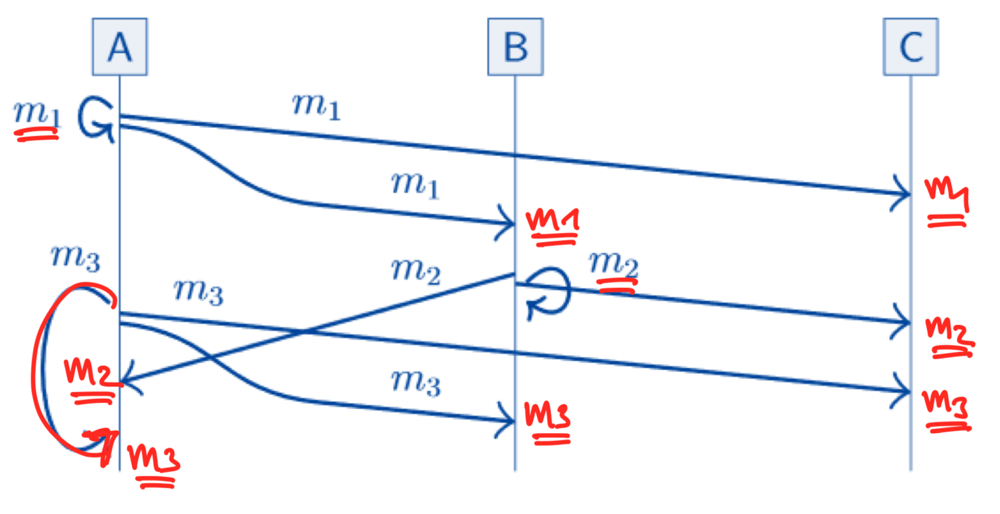

## FIFO-Total Order Broadcast

Combination of FIFO and Total Order Broadcast

## Relationship between broadcast protocols

> 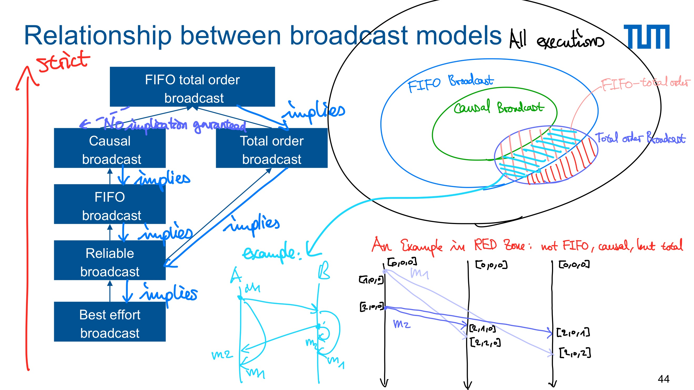

## Implementing Broadcast Algorithms

- 2 steps:

  1. Best-effort -> reliable (retransmit dropped msgs)
  2. Reliable -> Reliable with some delivery order enforced

- Reliable broadcast

  - Naive: send msgs to all other nodes with reliable links (retry + deduplication)
  - Eager: rebroadcast msgs to all other nodes (inefficient: O(n^2) for n nodes)
  - Gossip protocol: rebroadcast msgs to 3 other randomly chosen nodes (useful when n is large)

- Enforcing delivery order
- FIFO broadcast Algorithm
  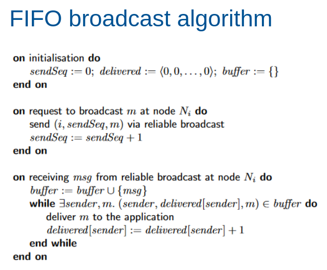
- Causal broadcast Algorithm
  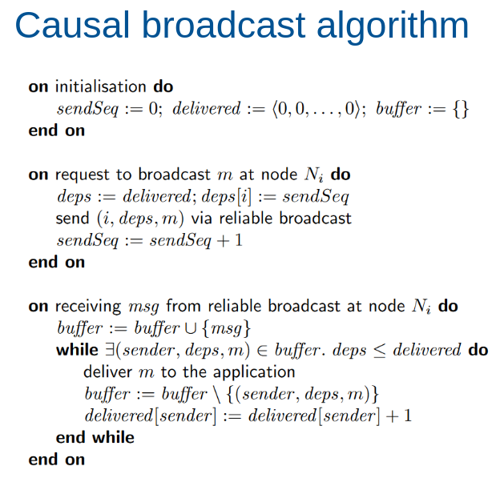
- Total order broadcast Algorithms
  - Single leader: leader broadcasts messages to all other nodes via FIFO
  - Logical clocks: attach vector to messages, **deliever in total order of vector clocks** (use FIFO links, wait for msg with lower vector clock from all nodes)

## Replication using Broadcast

Client broadcast requests to replicas.

- Best-effort broadcast: unreliable, no ordering
- State machine replication: total order broadcast
  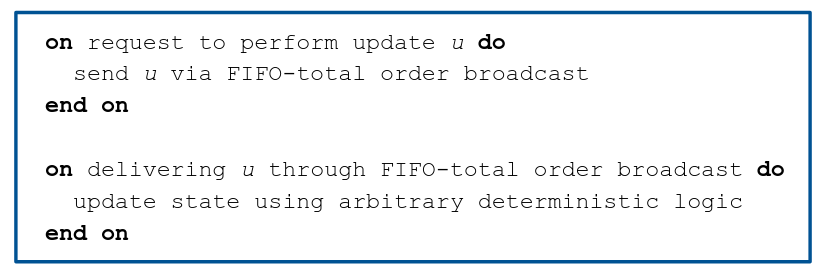
  - FTOB every update to all replicas
  - Apply <=> Deliver (Deterministic)
  - Replica is a state machine
    - Fixed initial state
    - Same order of same state transitions
    - Same end state
  - Limitation: no immediate update, have to wait for delivery through broadcast
  - Close related: serializable transactions, blockchain, distributed ledgers, smart contracts
- Database leader replication (ensures total order broadcast)
  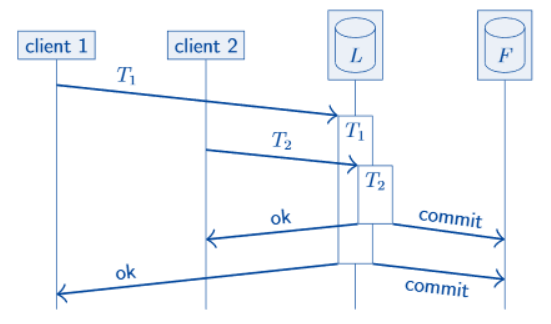
  > Followers applies transaction logs in commit order
- Causal (and weaker) broadcast
  - We can use a weaker form than total order broadcast if e.g updates are commutative: process updates in different order but end up in same state (_f_ and _g_ are commutative if _f(g(x)) = g(f(x))_)
    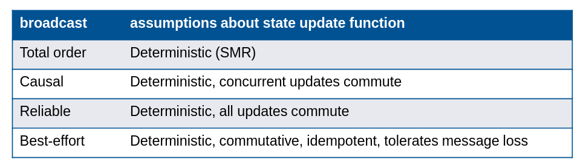

> (F)TOB is still not fault tolerant: single node crash stops all other nodes from delivering messages -> need consensus
