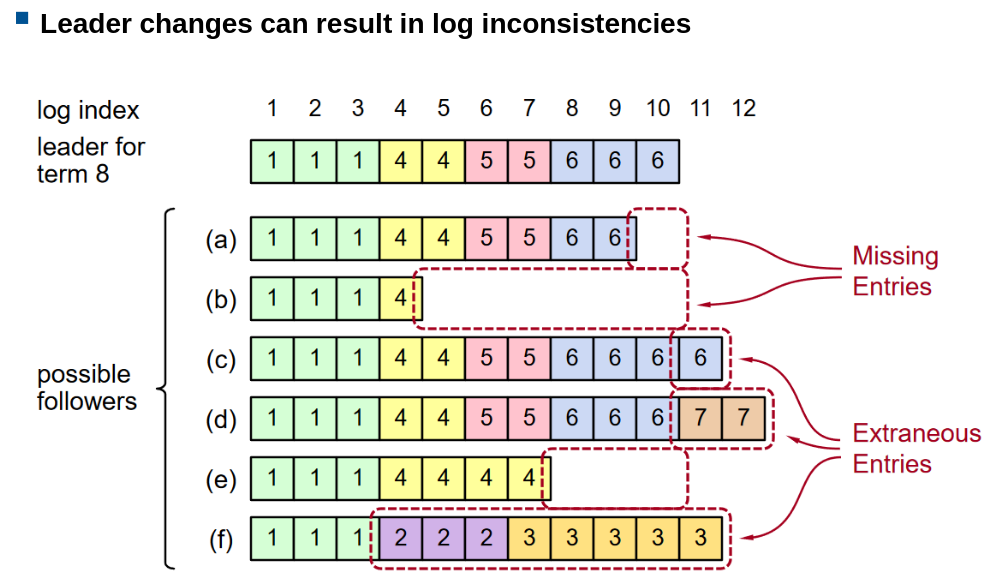

# Consensus

Properties

- Uniform agreement: all nodes decide the same order
- Integrity: no node decides twice
- Validity: any decided value is proposed by some node
- Termination: not crashed node eventually decides some value

Common consensus algorithms

- Paxos: single-value consensus (hard to understand, implement and educate)
- Multi-Paxos: generalization to total order broadcast
- Raft, Viewstamped Replication, Zab: FIFO-total order broadcast by default

## System Models

### Assumptions (Raft, Paxos etc.)

- Partially synchronous
  - No global clock
  - Unbound message delay
  - No upper bound processing time
- Crash-recovery

> Why not asynchronous
>
> - FLP (Fischer, Lynch, Paterson) result: no deterministic consensus algorithm guarantees to terminate in asynchronous crash-recovery system model
> - Paxos and Raft etc. clocks only used for timeouts/failures detector to ensure progress. Safety (correctness) does not depend on timing.

### Leader

- Failure detector: only elect when leader unresponsive
- Election: votes of quorum
- Equal or less 1 Leader per term

## The Raft consensus algorithm

Leader election and log replication

### Properties

- Election Safety: at most one leader can be elected in a given term

- Leader Append-Only: a leader never overwrites or deletes entries in its log; it only appends new entries.

- Log Matching: if two logs contain an entry with the same index and term, then the logs are identical in all entries up through the given index.

- Leader Completeness: if a log entry is committed in a given term, then that entry will be present in the logs of the leaders for all higher-numbered terms.

- State Machine Safety (key safety property): if a server has applied a log entry at a given index to its state machine, no other server will ever apply a different log entry for the same index.

### Node states and transitions

- Follower: passive, expect regular heartbeats, become candidate in case of leader crash (unresponsive within a timeout typically randomly between 100-500ms, different for each) and starts new election
  > Nodes start as Followers
- Candidate: active, issues RequestVote RPCs to get elected
- Leader: active, issues AppendEntries RPCs to
  - Replicate its log
  - Heartbeat to maintain leadership

### Terms

- Max. 1 leader per term (0 when failed election)
- Each node maintains own current term value
  - Exchanged in every RPCs
  - Update term if incoming term is later, revert to follower if not follower
  - Reply with error if incoming term is obsolete

### Election

- Two different timeouts:

  - Election timeout ([T, 2T] e.g 150-300ms): the time a Follower waits to become a candidate, i.e the time a Follower has not received a RPC (heartbeat msg)
  - Heartbeat timeout (50-150ms): the time interval a leader sends a heartbeat msg (Empty AppendEntries RPC)
    > Heartbeat TO < Election TO to ensure followers receive regular leader messages and don't mistakenly start a new election

- New election and leadership maintenance

  - The Follower **who first times out** becomes a Candidate
  - This Candidate votes for itself and sends RequestVote RPCs to all other nodes
  - Others reply with a vote if they have not voted in the same term (Safety), and **reset their election timeout**
  - Candidate becomes Leader if it receives votes from a majority of nodes
  - The Leader starts sending heartbeats to maintain leadership
  - If the Leader crashes, the Follower first times out will become Candidate and start a new election
    > Works well when T >> broadcast time, because there might be case where a Follower becomes Candidate and sends a RPC, but before the RPC reaches other Followers, one Follower also times out and becomes a Candidate and it cannot vote after receiving the RPC
  - If two Followers become Candidates at the same time and receive mojarity at the same time, they don't become Leaders, instead the timeouts for them and all other Followers continue: the one first times out will become Candidate

- Liveness: some Candidate must eventually become Leader

### Log Structure

- Log entry = [Index, Term, Command]
  > E.g the second entry of the Leader's log is [2, 1, x := 3]
- Stored on stable storage, survives crashes
- Entry **committed** if **safe** to execute in state machines but not executed yet
  > Safe: replicated on majority of nodes

### Normal operation

1. Client sends command to Leader
2. Leader appends command to its log
3. Leader replicates log to Followers (**via AppendEntries RPC**)
4. Once new entry commited
   - Leader execute command in its state machine, returns result to client
   - Leader notifies followers if committed entries in subsequent AppendEntries RPCs (**retry until succeed** if crashed/slow followers)
   - Followers execute commited command in their state machines

### Log Consistency

- AppendEntries consistency check
  1. AppendEntries RPCs include <index, term> of the entry preceding new ones (Example #1)
  2. Follower rejects the request if it does not contain matching entry (Example #2)
  3. Leader retries with lower index (Example #3)
     
     > If a given entry is committed, all preceding entries are also committed

### Leader changes

Old leader may have left entries partially replicated (uncommitted) on its log. Multiple crashes can leave many extraneous entries in logs, because the old Leader received requests from client and crashed immediately before broadcasting the entries to followers, hence a new Leader may not have the new entries in its log.

> In theory, the Leader sends out log at the same time, follower receives them at the same time and response at the same time, hence no partial commit. But in practice, geographical distance, network delays, failures etc. it's **never perfectly synchronized**, so partial commit is possible.

### Safety Requirements

- Leaders never overwrite entries in their logs
- Only entries in the Leader's log can be committed
- Commit before applying to state machine

To meet above requirements:

- Once a log entry has been applied to a state machine, no other state machine may apply a different value for the that log entry
- Raft safety protocol: once a log is committed, it will be present in the logs of all future leaders

### Picking the best Leader

Candidate with log most likely contain all committed entries is chosen:

- Candidates attach `<latestIndex, latestTerm>` to RequestVote RPCs
- Voting Follower compares its `<latestIndex, latestTerm>` with the incoming one, denies vote if its log is more up-to-date

### Commit

- The Leader maintains a `commitIndex`, the index of the highest log entry known to be committed. An Entry is committed if it is acknowlegded by the Leader that it is replicated on a majority of nodes and `commitIndex >= index`.

- In the example, the second entry is replicated in majority but is still not committed (c), so it can be overwritten like in (d).

> If an entry is replicated on a majority of nodes, because Leader is crashed after that, the Leader's `commitIndex` is not updated, the entry is still not considered committed

### Log Inconsistency

- When the top one becomes leader of term 8, any of (a)-(f) could occur in follower logs, either missing entries (a-b), or having extraneous entreies (c-d), or both at the same time (e-f).
- For example: (f) could occur if that node was the Leader of term 2, added several entries to its log, then crashed before committing any of them; it restarted quickly and became Leader of term 3, and added a few more entries to its log; before any of the entries in either term 2 and term 3 were committed, it crashed again and remained down for several terms.

### Repair Follower Logs

- Delete extraneous entries
- Fill missing entries
- Leader keeps `nextIndex` for each follower, the index of the next log entry to send to that follower within RPC.
- `nextIndex` for every Follower is initialized when the Leader is elected, to the Leader's latest log index + 1, because Leader assumes that the Follower has all entries up to date, so it can start appending new entries from the next index when new requests come in.
- If a AppendEntries consistency check fails, the Leader decrements `nextIndex` and retries

> All subsequent entries are deleted

### Neutralizing Old Leaders

- Desposed Leader may not be dead: temp disconnected from network
  - New Leader is elected
  - When old Leader reconnects, it still tries to maintain leadership, but will step down as soon as it discovers a bigger new term through RPCs and reverts to Follower (same for Candidates)

### Client Protocol

- Send command to Leader: if unknown, contact any node, will be directed to Leader
- Leader does not reply to client until command has been log, committed and executed to state machine
- If request times out (e.g Leader crash), client retries [Send command to Leader] again

- In case Leader crashes after executing command, but before responding
  - Server includes a unique id for each command in log entry
  - Before executing, Leader checks if the command has been executed before by checking the unique id is in the log entry
  - Found: ignore and response from old command

> This way, commands will not be executed twice (by new Leader) -> **exactly-once semantics** (as long as client does not crash)

### Configuration Changes

- System configuration:
  - ID, address for each server
  - Determines what constitues a majority
  - Set of servers

> - Example of growing from 3 to 5 servers: conflict
> - The color green and blue simpliy mean how the respective server perceives the configuration (set of servers). There is a time in the middle where Server 1 and 2 think the config is server 1-3, while server 3-5 use config 1-5

- Solution: Joint Consensus (2-phase approach)

  - Intermediate phase uses joint consensus: needs majority of both old and new configuration for election, commited
  - Configuration is just a log entry - issued by Leader - issued when new server is added, server is removed, or need rebalance
    
    - Timeline for a configuration change. **Dashed lines show configuration entries that have been created but not committed, and solid lines show the latest committed configuration entry.** The leader first creates the C_old,new configuration entry in its log and commits it to C_old,new (a majority of C_old and a majority of C_new ). Then it creates the C_new entry and commits it to a majority of C_new. **There is no point in time in which C_old and C_new can both make decisions independently**
    - Once a given server adds the new configuration entry to its log, it uses that configuration for all future decisions (a server always uses the latest configuration in its log, regardless of whether the entry is committed)

### Raft Protocol

Once a
given server adds the new configuration entry to its log,
it uses that configuration for all future decisions (a server
always uses the latest configuration in its log, regardless
of whether the entry is committed)

### Limitations of consensus

Cost of supporting agreement, integrity, validity and fault-tolerance:

- Synchronous-based replication: worse performance than async
- Strict quorum majority to operate: min 3 nodes to tolerate 1 failure, min. 5 nodes to tolerate 2 failures
- Static membership algorithm (fixed set of nodes in the cluster: cannot simply add/remove nodes, requires reconfiguration)
- Relies on timeouts to detect failed nodes: issues when highly variable network delays
