# Consistency

Different meanings in different contexts

- ACID: a transaction can only **bring the database from one consistent state to another, preserving database invariants**. Any data written to the database must be **valid** according to all defined rules.

- RAW Consistency
- Replication: consistency across replicas (same state and same result for read)
- Consistency model

> Most system provides **eventual consistency**: edge case when fault/high concurrency.

## Trasnaction isolation levels

- Serializable: strictest, outcome of transactions is the same as if they were executed sequentially, even they were actually run concurrently.

- Repeatable read: if a transaction reads a data twice, it sees the same results.

- Read committed: a transaction sees only committed changes.

- Read uncommitted: a transaction can read uncommitted changes.

> Different from Consensus: If the transaction updates data on multiple nodes
>
> - all nodes commit/abort (as a single unit)
> - if any node fails, all nodes must abort

## Consistency models

- **Strict Consistency:** Every read reflects the very latest write instantly—a theoretical ideal requiring a global clock.

- **Linearizability:** Operations appear to occur atomically in real time; if one finishes before another starts, all clients see them in that order.

- **Causal Consistency:** Only causally related operations are ordered consistently; concurrent operations may be seen in different orders.

- **Monotonic Reads/Writes:**  
   - **Monotonic Reads:** Once a value is read, later reads won’t return an older value.  
   - **Monotonic Writes:** A client’s writes are applied in the order issued.

- **Read-Your-Writes:** A client always sees its own updates in subsequent reads.

## Two-phase commit (2PC)

Most common algorithm to ensure **atomic commit across multiple nodes**.z

> 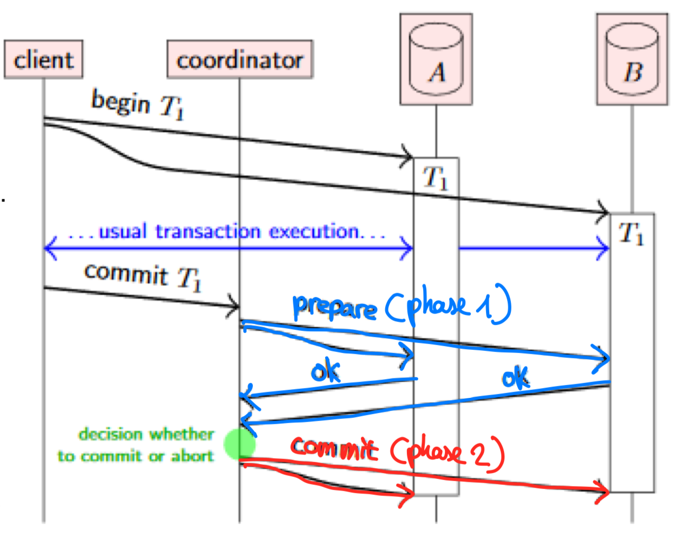
>
> 1. Coordinator sends `prepare` to all participants
> 2. Participants reply `yes` or `no`, if all `yes`, coordinator sends `commit`, otherwise `abort`

Problems:

- If coordinator crashes after prepare
  - crashes before sending commit/abort decision: participants are blocked
  - crashes after sending commit/abort decision: it wrote decision to disk, reads after recovery and sends decision again

Solution: consensus algorithm (**TOB**, see below)

### Fault-toleranct 2PC

Based on Paxos Commit

- Every participant use **TOB** to dissanminate its vote
- If node A suspects B has failed, A may try to vote to abort on behalf of B
- Potential race condition: 2 conflicting votes from same node (from A and A on behalf of B) -> Resolved (TOB + counting only the 1st vote)
  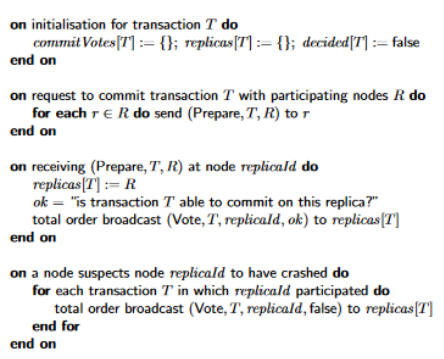
  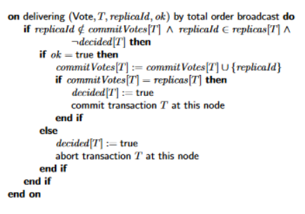

## Linearizability

- Serializability: Transactions will behave the same as if they had executed in some serial order -> **transaction isolation in databases**

- Linearizability: If an operation completes, all later operations will appear to have happened after it (**real time ordering, wall clock time, total order**) -> **distributed systems**
  - Operations not grouped in transactions
  - Potential write skew/phantom -> materializing conflicts
  - It makes a distributed system behave as if it were non-distributed

> A database may provide **both**: strict serializability/strong one-copy serializability (strong 1SR)

### When to use linearizability

- Locking and leader election
- Constraints and uniqueness guarantees
- Cross-channel timing dependencies

### RAW consistency

Linearizability generalizes it to ops made concurrently be different nodes

> 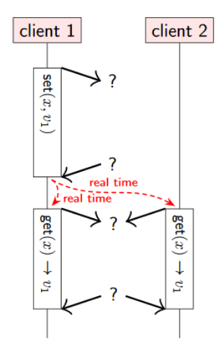 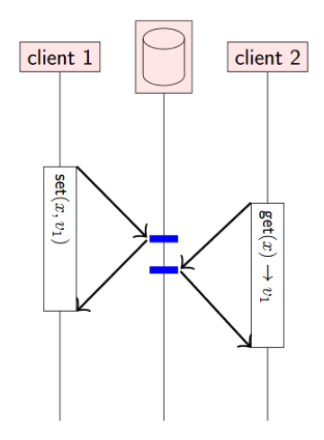
>
> P1: Black-box for client, even ops are on different nodes. **Not happens-before relation**: not commu between clients.
>
> P2: `get` overlaps with `set`. Either executed first is fine here.
>
> Op A finishes before Op B starts != A happens-before B, can still be concurrent, because no communication between these ops.

### Not linearizable despite quorum R/W

> 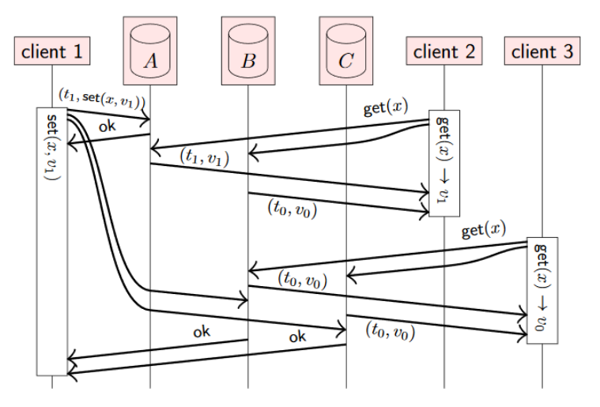
>
> **Linearizability between `get`s**: A get updated quickly, B and C are delayed.

- Solution (ABD Algorithm): send read request to **all** nodes and **wait for responses from a quorum**, if a more recent value is included then write it to all stale replicas, `get` finishes after ack from this write-back received (here `v1` is more recent than `v0`)
  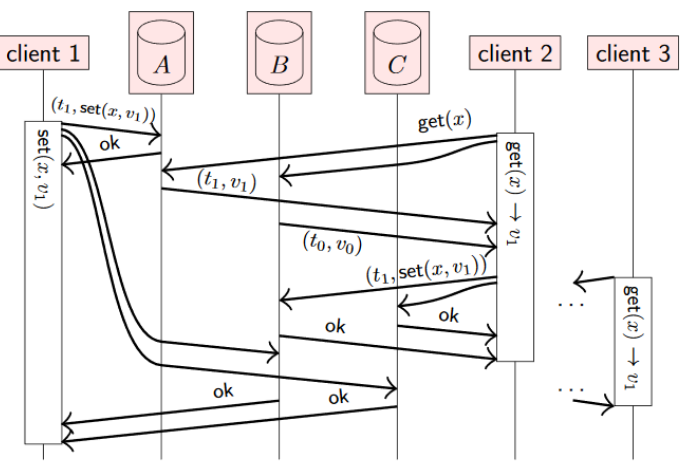

- Compare-and-swap (CAS): `CAS(x, oldValue, newValue)`: if `x` is `oldValue`, set `x` to `newValue`.
  > Linearizable not with ABD but with consensus
  > 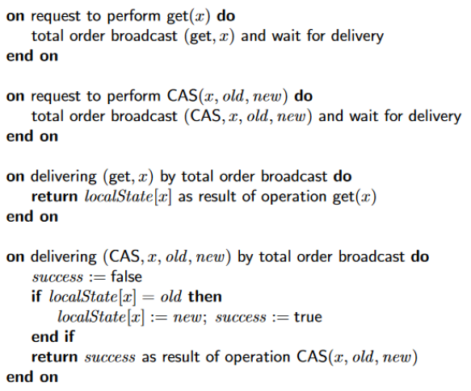

### Downsides of Linearizability

- Performance cost: lost of msg, waiting for response
- Scalability: limited by leader
- Availability: quorum is a must, otherwise no operation can be performed

## Eventual Consistency

Weaker model than linearizability: if no more updates, **all replicas will eventually** converge to the **same state**, **no guarantee how long** it may take.

- No waiting for network communication
- Causal or weaker broadcast can dissanminate updates
- Concurrent updates: conflicts

### Causal Consistency

System obeys the ordering inmposed by causality.

- Example: snapshot isolation, read and see some data, then must be able to see any causally preceding data.

> - **Causality: partial order**
> - **Linearizability: total order**
> - Linearizability implies causality at a cost
> - Causal dependency is the **strongest** consistency model **not slowing down due to network delays** and remains **available under network partitions**
>
> Snapshot isolation: concurrent transactions operate on a snapshot of the database -> illusion: running is isolation

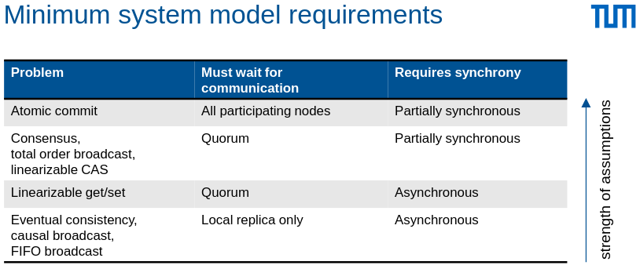

## Collaboration and conflict resolution

Reconcile concurrent updates.

- Algorithms

  - CRDT (Conflict-free Replicated Data Types)
  - Operational Transformation (OT)

- Example
  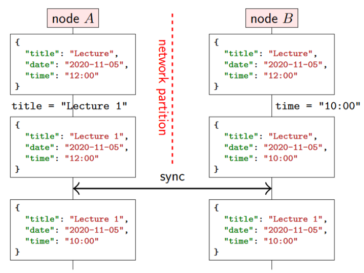

### Operation-based CRDT

Access through object-oriented interface: set, list, map, tree etc.
Map as example:

- Local state: `(timestamp, key, value)`
- Read: return local value
- Write: create globally unique timestamp, reliable broadcast (delivery in any order, only communative) the triple
- Conflicts: last write wins (LLW)

### State-based CRDT

Definitions are same as operation-based, bigger message size.

Instead of operation, apply and **broadcast the state of the object**, on state on delivery: **merge function _f_ comparing timestamps**, _f_ satisfies:

- Associative
- Commutative
- Idempotent

> Not necessary use broadcast: e.g. unreliable best effort, quorum works

### Collaborative Text Editing

Several users edit the same text document concurrently: clashed operations

Problem: inconsistent states between users
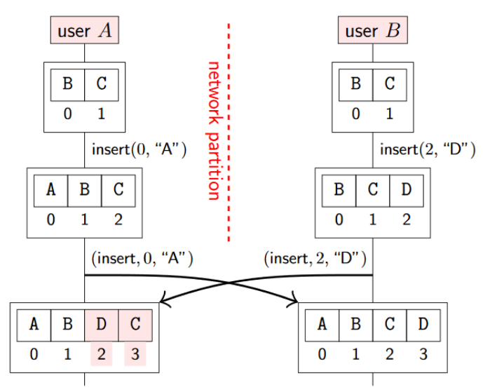

Solution: Operational Transformation (OT)
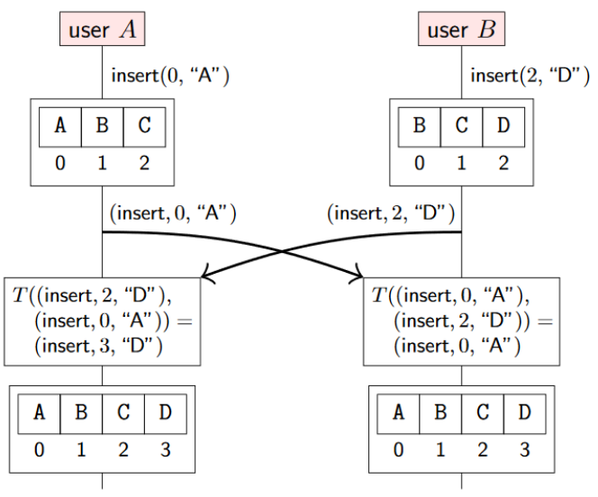

> Both started with BC

Solution: label each character with a unique identifier
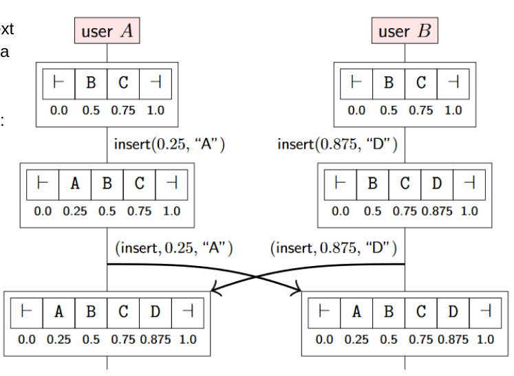

> When inserting a new character between two existing ones, we assign the character with a position number between _i_ and _j_ e.g _(i+j)/2_

### Usage in Practice

- Google Docs
- Apple Notes
- Fluid Framework (Microsoft)
- Redis
