# OLAP in the Cloud

## Data layout: column-store vs. row-store (OLTP)

- Column-stores (OLAP)
  - Read relevant data (skip irrelevant columns)
  - Suitable for analytical workloads (better cache, SIMD, lightweight compression usage)
- Compression is key: excellent synergy with column-stores
- Pruning: skip irrelevant data (rows)

## Table partitioning and distribution

- Distribution (Parallelism, system-driven): each computer gets a piece of data and each query works on every piece
- Partitioning (user-specified)
  - Goal 1: data lifecycle management (how long to keep data e.g 6 months, update interval e.g every night)
  - Goal 2: improve access pattern with partition pruning

## Query Execution

Scalability is not as important (unless making the most of the hardware)

- Vectorized execution: improve I/O and cache efficiency
- JIT code generation: improve CPU efficiency

## Cloud-native warehouses

Designing, building, and running applications optimized for cloud environments. It emphasizes scalability, elasticity, fault-tolerance, and automation by leveraging cloud computing principles.

### Challenges cloud-data at cloud-scale

- Storage: abstraction storage format, distribution, caching across hierarchy
- Query execution: distribution, optimization, resource scheduling

## Shared-nothing architecture

### Overview

> 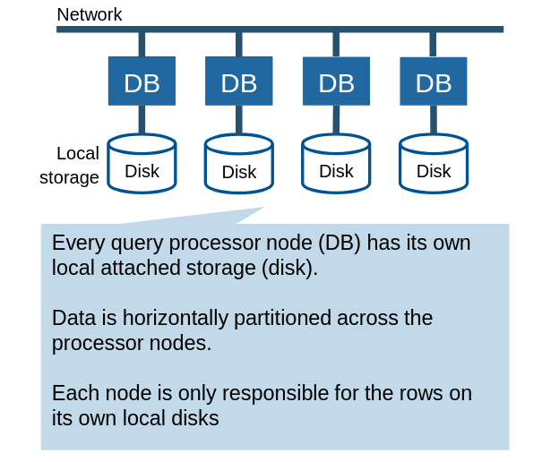
>
> Scales well for star-schema queries
>
> - Little brand-width needed for small dimension tables
> - Large fact table can be partitioned across nodes

### Worker instance

> 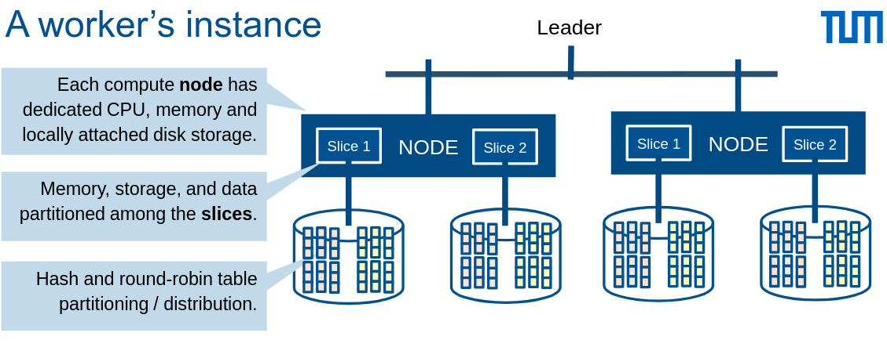
>
> - Leader distributes data (or user specifies using a distribution key) and assigns workloads to slices
>
> - #Slices depends node size

### Slice

- Q: Why is sorting important?
- A: Range queries, compression efficiency etc.
  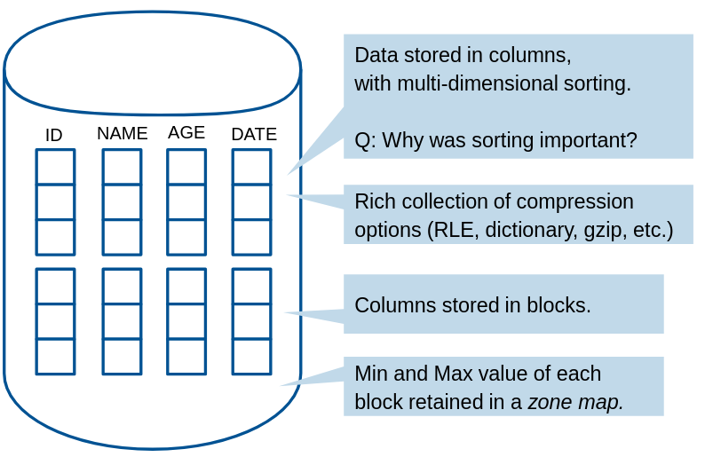

### Fault tolerance

Make blocks small (e.g 1MB), replcate on different node, stored and replicate (triply) on S3

- Node failure example
  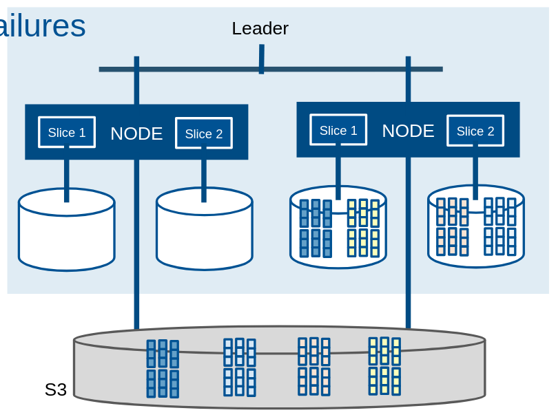

Options:

1. Process on node 2 until node 1 is recovered
2. Instantiate a new node 3 until node 1 is recovered

### Example: AWS Redshift (old version)

> 
>
> - Shared-nothing
> - Classic MPP, JIT C++
> - Standard AWS services (S3, EC2, EBS), Virtual Private Cloud (VPC)
> - Redshift cluster: Leader + Compute nodes (Leader parses, plans, compiles and distributes queries, aggregates results and returns to client)

### Drawbacks of shared-nothing architecture

- Tightly coupled compute and storage

- Heterogeneous workloads
  - (+) Good for bulk loading (high I/O, light compute)
  - (-) Bad for complex queries (low I/O, high compute)
- Membership changes: potential high volume of data reshuffling
- Online upgrades: hard because of tight coupling

> Problematic in cloud setting

## Shared-storage architecture

### Seperate compute and storage

- More flexible scaling up/down of both
- Better elasticity for user
- Storage is abundant and cheaper than compute

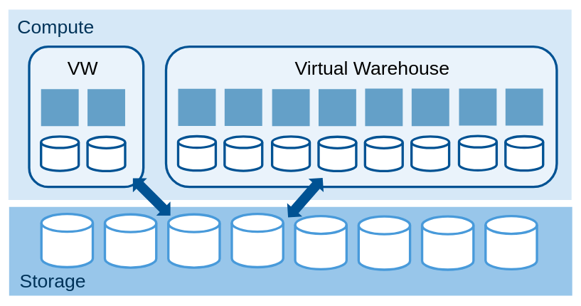

#### Virtual warehouses

- Dynamically created pure cluster of compute instances (create, destroy, resize)
  - Sizing: Number of EC2 instances, #cores, I/O capacity
- Local disk cache file headers and table columns
- Each query mapped to exactly one VW, which can run mutiple queries in parallel
- Every VW has access to same shared data (no copy needed)

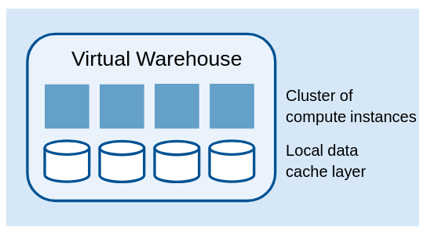

### Disaggregated Compute-Storage Architecture

> 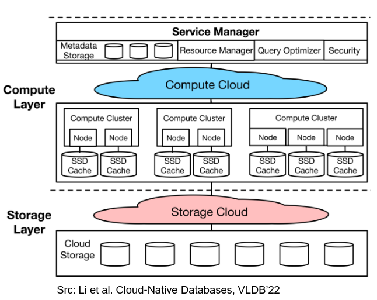
>
> Multi-tenancy, local SSDs caching

- Elasticity: scale compute and storage independently
- Availability: tolerate cluster/node failures
- Heterogeneous workloads: high I/O or heavy compute

### Disaggregated Compute-Memory-Storage Architecture

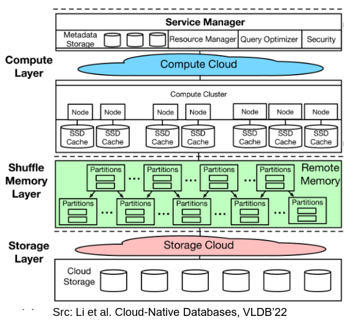

- Cope with large intermedia results
- Shuffle-memory layer for speeding up joins

Example:
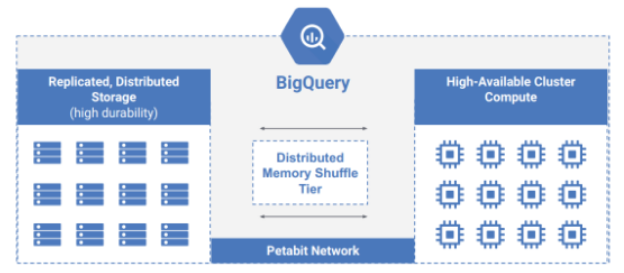

> 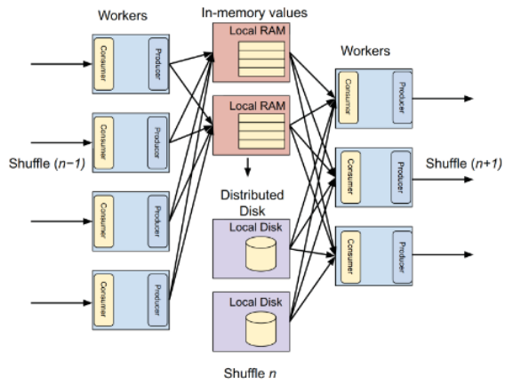
>
> - Producer: partition and sends to shuffle layer
> - Consumer: combines partitions and perform operations locally
> - Large intermedia results: spill to local SSD

## Stateless shared-storage architectures

- Seperate compute and state/storage: Compute nodes does not hold any state information
- Stateful: when a compute node fails, the state of non-committed in-flight transaction is lost -> need stateless

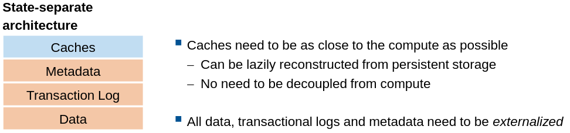

### Example: Polaris

> 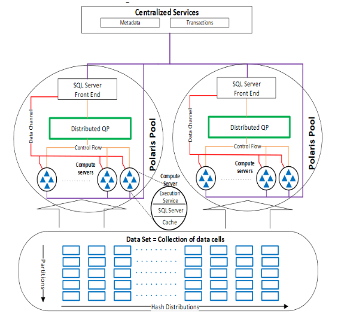
>
> - Compute done by Polaris pools
> - Stateless architecture within a pool: data in remote, log in centralized services

#### Storage layer considerations

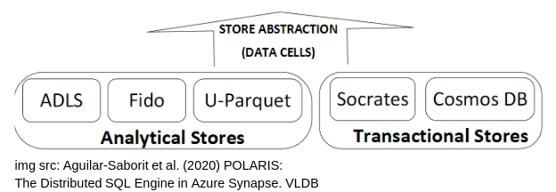

- Data cells: abstraction
- Hash-based distribution
- Partitioning function _p(r)_ used for range pruning: executed during query

#### Distributed query processing

All queries compiled into 2 stages:

1. Uses **SQL server query optimizer** to generate all **logical equivalent** plans to execute a query
2. Distributed **cost-based** query optimization to enumerate all **physical distributed implementations** of these logical query plans

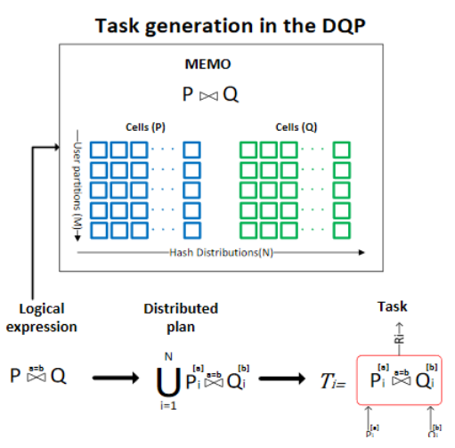
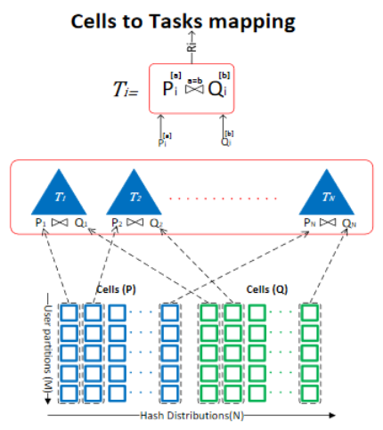

#### Task

_Ti_ is physical execution of an operator _E_ on the _i-th_ hash-distribution of its inputs

Three components:

- Inputs: collection of data cells
- Template: code to execute representing _E_
- Output: collection of cells produced by task

> 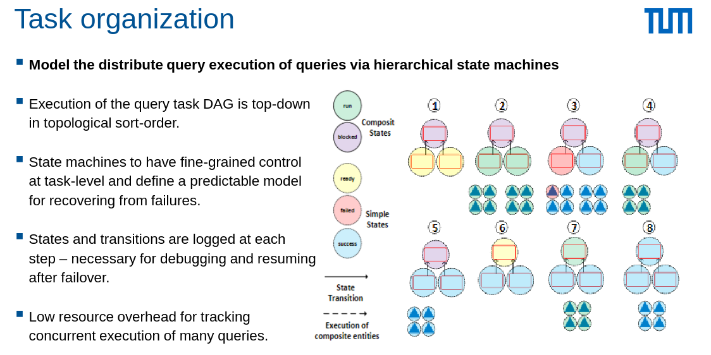
> Fined-grained orchestration of tasks using state machines

## Serverless

Query without worrying about resource provisioning, **pay by query** granularity

Two main approaches:

- Serverless Databases: rely on cloud SQL engine and storage to execute
- Serverless functions (FaaS, stateless) + cloud storage

### Serverless functions + cloud storage

Two challenges:

- Functions are **stateless**
- **Straggler** increases overall latency of parallel processing

Approaches:

- Use **cloud storage** to **exchange state**
- Use **tuned models** to detect **stragglers** and invoke functions witn **duplication computation**

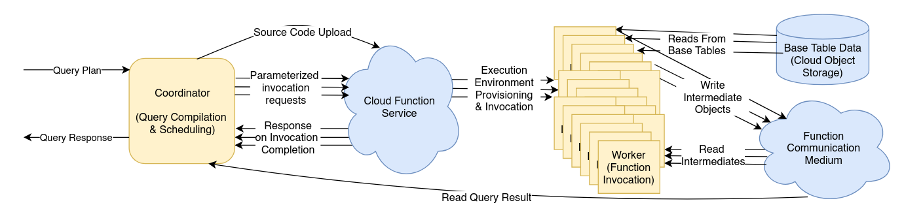

#### Query processing using lambda functions

> 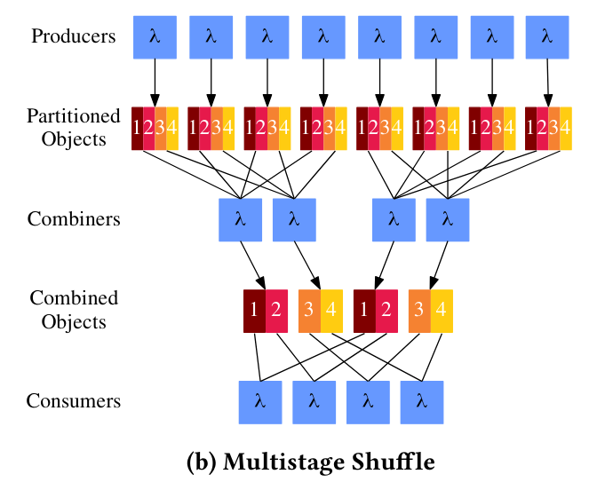
>
> Trade-off: #invoked tasks (performance) vs. cost

### Cold starts

A function is invoked for the first time/after a period of inactivity: new container/runtime provisioned -> initial latency

Approaches:

- Availabile **pre-warmed** instances
- **Reduced function size** -> faster initialization
- **Predictive** function initialization for **repetitive tasks**

### Summary

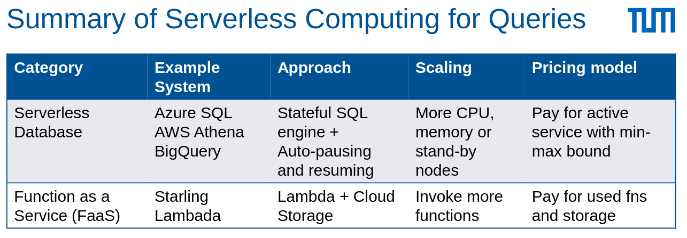

## Summary of architectures

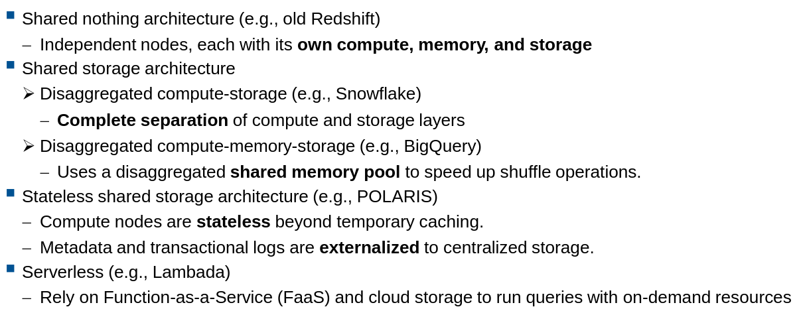

## OLAP in the cloud Building Blocks

### Shuffling Primitive

A low-level **operation** that moves and **redistributes data between processing nodes** in an OLAP system.

Goal: enable scale-out for all query plans

Network-based exchange operator:

- Hash-based (e.g. GROUP BY keys)
- Range-based (sort)
- Random (avoid skew)

Big design space
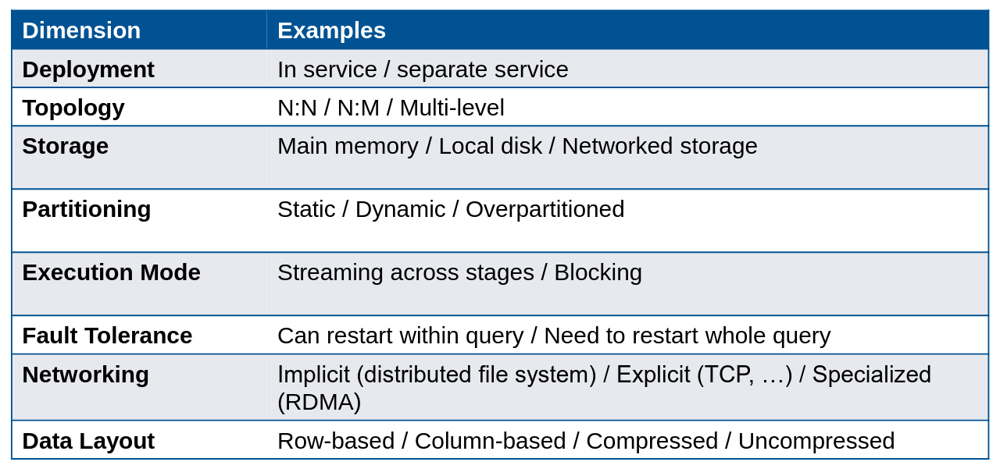

### Query Optimization

Three phases:

1. Query undergoes **Logical Optimization**: efficient and logically equivalent **query plan before distribution**
   - Rule-based: Predicate Pushdown, Redundant Join Removal
   - Cost-based: Join Reordering based on estimated cardinalities
2. Translated to **"canonical" distributed plan**

   - Insert shuffles -> correct distribution plan
   - (Can run right away correctly but slow)

3. Query undergoes **Distribution Optimization**:
   - Select Broadcast Joins
   - Eliminate redundant shuffles
   - Sideways information passing (**info is shared** across operators)

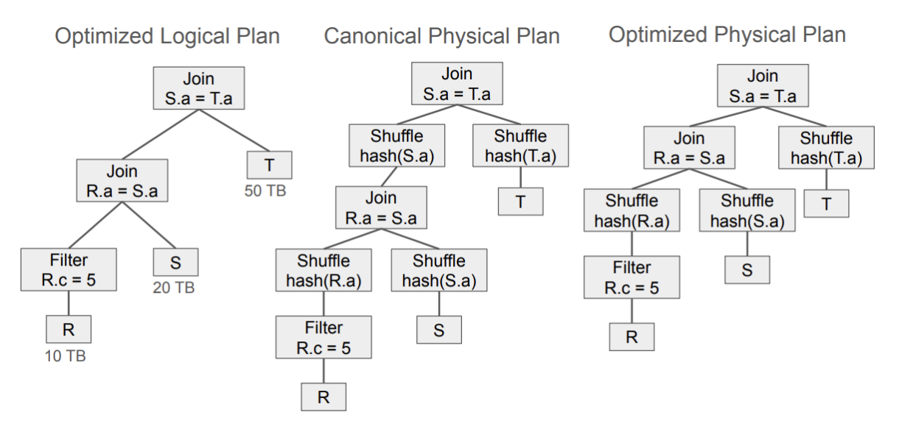
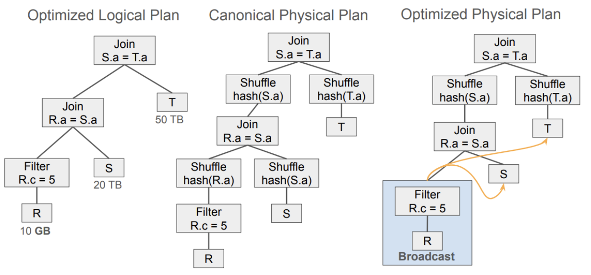

### Query Orchestration (Firebolt)

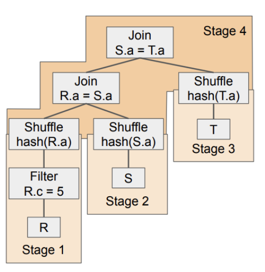

- Distributed query plan broken into **stages**
- Every stage executed on a **subset of nodes**
- Scheduler: **topological sort** to identify **stage ordering**

#### Local Runtime

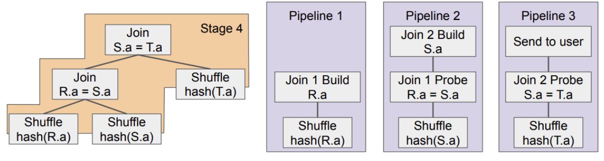

- Stage plan -> execution plan for single-node runtime
- **Execution plan**
  - Reading data (via table scans or getting shuffled data)
  - Processing data (joins, expressions, aggregations)
  - Outputting data (sending to other nodes or returning to user)
- Stage is split into **pipelines** (**morsel-dirven parallelism**: query divided into small chunks called morsels)

### Resource Management Challenges

- How can you estimate the resource consumption of a stage?
- What stages should overlap during execution?
- How do you decide whether to queue a query?
- How do you scale for concurrency?
- How do you minimize the cost of a workload?
