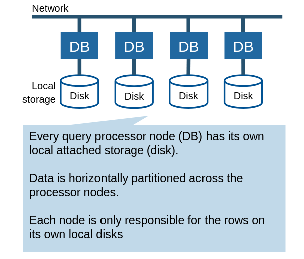

# OLTP in the Cloud

## Data layout: column-store vs. row-store

- Column-stores
  - Read relevant data (skip irrelevant columns)
  - Suitable for analytical workloads (better cache, SIMD, lightweight compression usage)
- Compression is key: excellent synergy with column-stores
- Pruning: skip irrelevant data (rows)

## Table partitioning and distribution

- Distribution (Parallelism, system-driven): each computer gets a piece of data and each query works on every piece
- Partitioning (user-specified)
  - Goal 1: data lifecycle management (how long to keep data e.g 6 months, update interval e.g every night)
  - Goal 2: improve access pattern with partition pruning

## Query Execution

Scalability is not as important (unless making the most of the hardware)

- Vectorized execution: improve I/O and cache efficiency
- JIT code generation: improve CPU efficiency

## Cloud-native warehouses

Designing, building, and running applications optimized for cloud environments. It emphasizes scalability, elasticity, fault-tolerance, and automation by leveraging cloud computing principles.

### Challenges cloud-data at cloud-scale

- Storage: abstraction storage format, distribution, caching across hierarchy
- Query execution: distribution, optimization, resource scheduling

## Shared-nothing architecture

### Overview

> 
>
> Scales well for star-schema queries
>
> - Little brand-width needed for small dimension tables
> - Large fact table can be partitioned across nodes

### Worker instance

> 
>
> - Leader distributes data (or user specifies using a distribution key) and assigns workloads to slices
>
> - #Slices depends node size

### Slice

- Q: Why is sorting important?
- A: Range queries, compression efficiency etc.
  

### Fault tolerance

Make blocks small (e.g 1MB), replcate on different node, stored and replicate (triply) on S3

- Node failure example
  

Options:

1. Process on node 2 until node 1 is recovered
2. Instantiate a new node 3 until node 1 is recovered

### Example: AWS Redshift (old version)

> 
>
> - Shared-nothing
> - Classic MPP, JIT C++
> - Standard AWS services (S3, EC2, EBS), Virtual Private Cloud (VPC)
> - Redshift cluster: Leader + Compute nodes (Leader parses, plans, compiles and distributes queries, aggregates results and returns to client)

### Drawbacks of shared-nothing architecture

- Tightly coupled compute and storage

- Heterogeneous workloads
  - (+) Good for bulk loading (high I/O, light compute)
  - (-) Bad for complex queries (low I/O, high compute)
- Membership changes: potential high volume of data reshuffling
- Online upgrades: hard because of tight coupling

> Problematic in cloud setting

## Shared-storage architecture

### Seperate compute and storage

- More flexible scaling up/down of both
- Better elasticity for user
- Storage is abundant and cheaper than compute

