# OLTP in the Cloud (DBaaS)

## Conventional OLTP Design

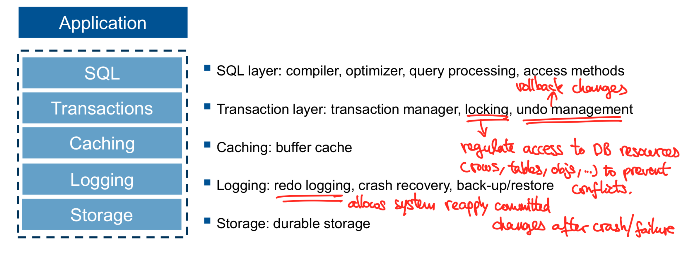

### Scale-out

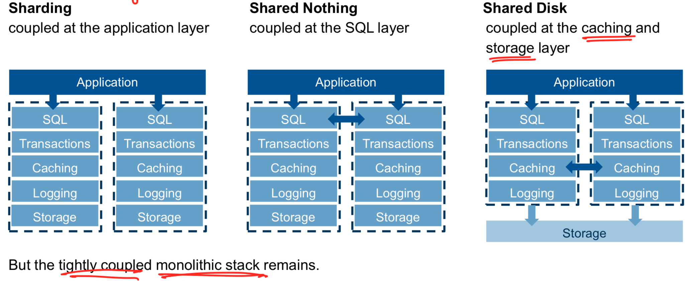

## Expectations

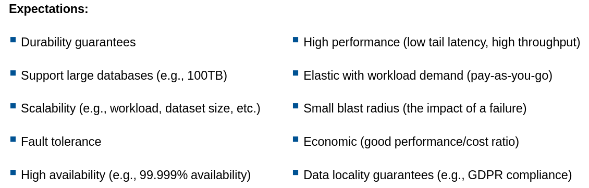

## State-of-the-art DBaaS Architecture

- Non-partitioned shared-nothing log replicated state machine (LRST)
- Non-partitioned shared-data
- Partitioned shared-nothing log replicated state machine

### Non-partitioned shared-nothing LRST

#### Primary Node

- Process all **update** transactions
- Ship update logs to followers
- Periodically backs up data to XStore (log: every 5min, full: every week)
  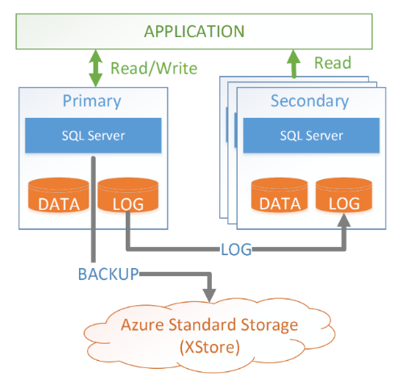

#### Follower: process read-only queries

> Need 4 nodes (1 primary, 3 seconderies) to guarantee high availability and durability

#### Advantages

- Stable and mature: HADR (High Availability and Disaster Recovery)
- High performance: every compute has full local copy of DB

#### Limitations

- Size of DB <= storage of single node
- Replicas, coupled load
- O(size of data) operations
  - Seeding a new node (data & state): **linear cost**
  - Backup/restore
  - Scale-up/down
- Special case: logs of **long running transactions** grow beyond storage of node

> SQL DB: size of database up to 4TB

### Non-partitioned shared-data LRST

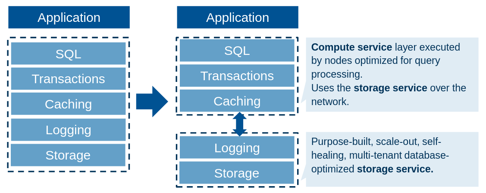

#### Log is the Database

Problem of RDBMSs: organize data in pages -> lots of redundant writes to disk

- Compute nodes only **write write redo log records** to distributed storage layer
- Storage layer reconstructs the page from log records **on demand**

Advantages

- Low write latency: no wait for updating pages in storage
- Reduced write amplification: log replay pushed down to storage, no multiple storage replicas
- Better elasticity: resource scaled independently

Example: Amazon Aurora
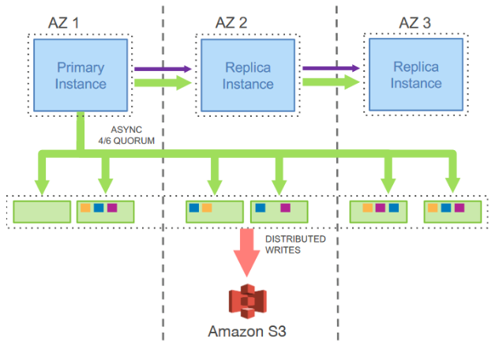

Advantages

- Reduced network I/O: **only logs and metadate** are sent to replicas -> more aggressive data replication
- Moving processing to storage layer: check-pointing, backup/recovery
  - Improved availability: lower recovery time
  - Minimize jitter caused by background processes

Limitations

- High read latency when a cache misses (log replay)

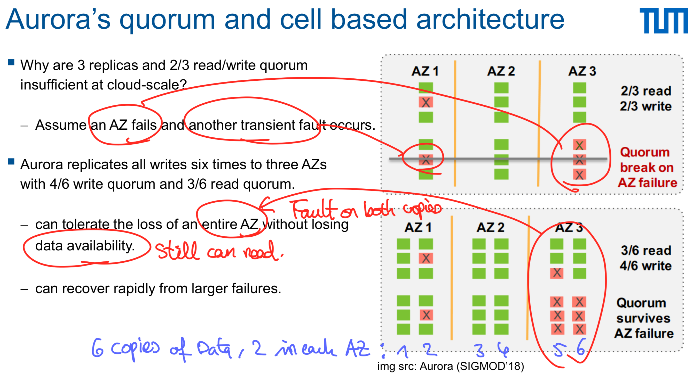

#### Data sharding: fast repairs and catch-up

Aurora replication:

- sharding: 10GB logical units, replicated 6 ways across storage fleets
- scale-out

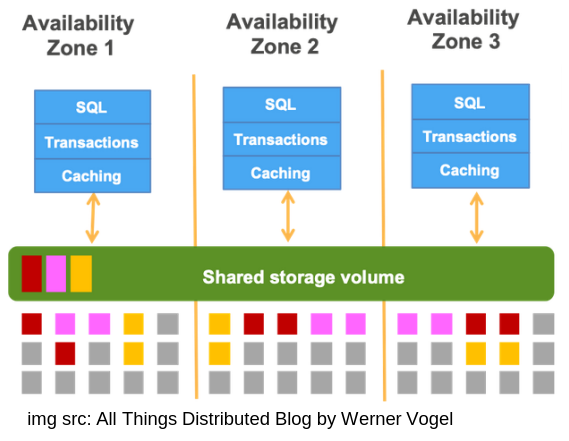

#### Storage layer

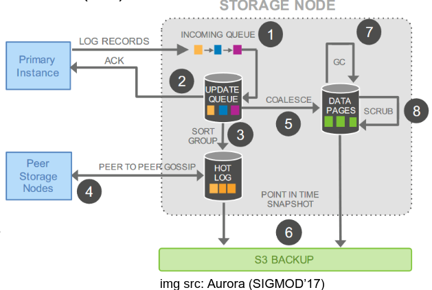
Each log record has a Log Sequence Number (LSN)

Storage node steps

1. Receive a log record and add it to an in-memory queue
2. Persist record on disk and acknowledge
3. Organize records and identify **gaps** on the log (some bacthes may be lost)
4. Gossip with peers to fill the gaps
5. Coalesce log records into new data pages
6. Periodically stage log and new pages to S3
7. Periodically garbage collect old versions
8. Periodically validate Cyclic Redundancy Check (CRC) codes on pages

#### Reads

- Most DBs: hit the **buffer cache**
- In case miss: quorum read too expensive -> client-side storage tracks writes <-> segments
- Quorum only when instance restart recovery (LSN Reconstruction)

#### Seperation durability and availability

Extended by Microsoft Hyperscale Socrates

- Durability: **Log (first class citizen)**, avoid data loss
- Availability: Storage

Why treat log seperately? -> Potential bottleneck of OLTP system

- Every update must be logged before commit
- Shipped to all replicas (sonsistency)
- Slow log Storage can hurt performance -> make it durable in fast storage

#### Disaggregated Compute-Log-Storage Architecture

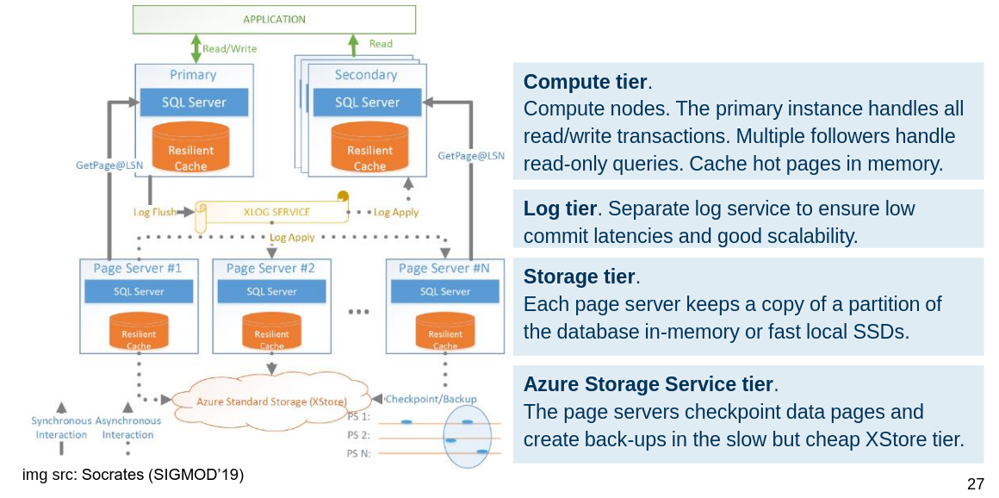

#### Logging as a cloud-native service

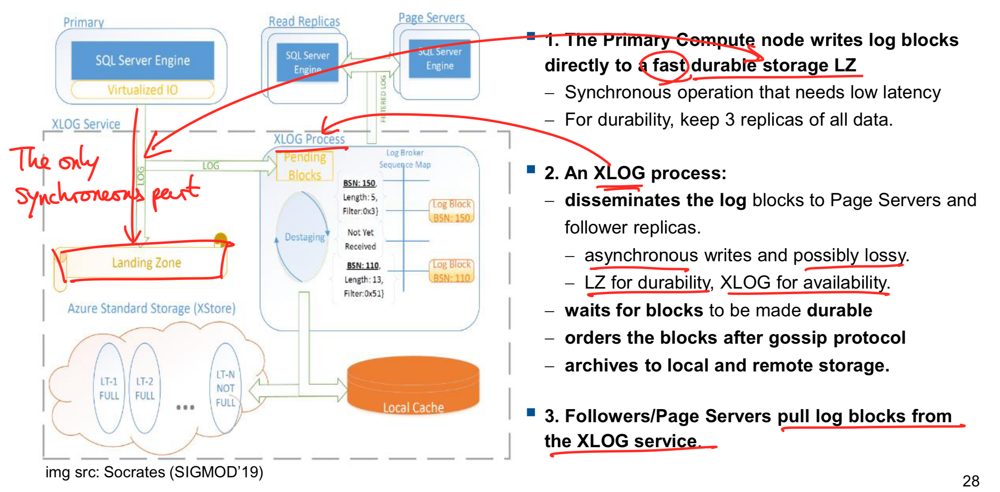

#### Summary Compute-Log-Storage

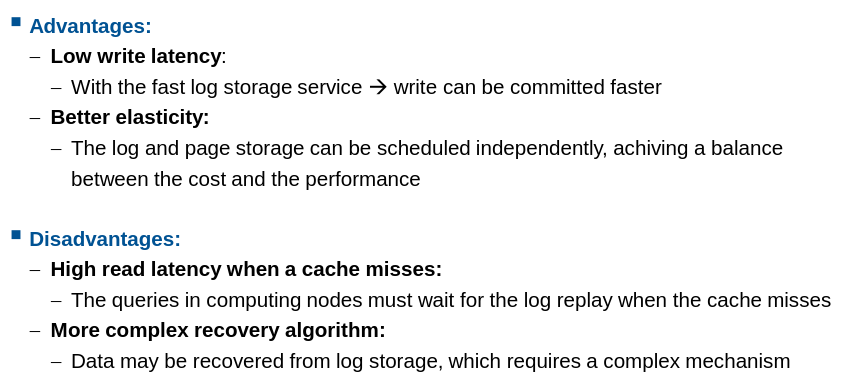

> Write is committed when it's **appended to the log**

#### Disaggregated Compute-Buffer-Storage Architecture

Elastic **Shared remote buffer** for all compute nodes (r/w-and ro-nodes)
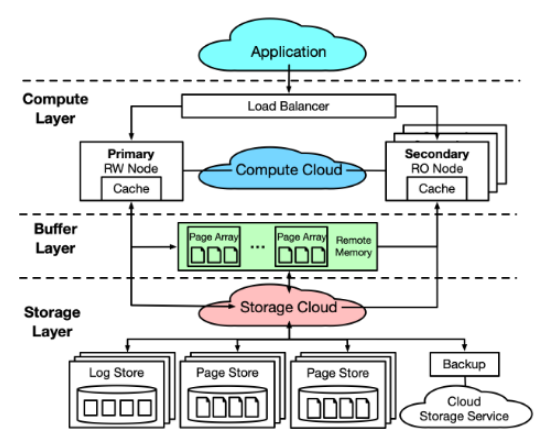

- Data write path: Primary updates local cache, generates redo log, page in buffer updated simultaneously, writes to log storage

- Data sync path: page in buffer not written to storage node, replayed to page storage async, transferred to ro-nodes

- Data read path: compute node checks local cache (miss -> check remote buffer -> miss -> read from storage node -> update local cache)

Summary
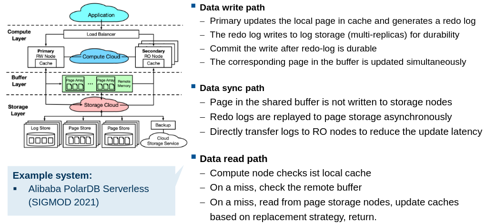

### Partitioned log-replicated state machine (Google Spanner)

Millions of nodes, petabytes of data, distributed globally

#### Consistency properties

- Serializable transactio isolation
- Linearizable reads and writes
- Many shards (**splits**): atomic commit of tnx across shards
  - **Splits** kept consistent using **Paxos**
  - Keeping **replicas** consistent: **True Time facility**

#### Standard techniques

- State machine replication (Paxos) within a shard
- 2PL for serializability
- 2PC for cross-shard atomicity

> RO-Txns require no lock

#### Consistent Snapshots

A **RO-Txn** observes a consistent snapshot

- Multi-version concurrency control (MVCC)
  - Each R/W-Txn has commit timestamp _tw_ and snapshot _tr_, it only observes most recent _tw <= tr_

> Observes **Causal consistency**

#### Obtaining commit timestamp

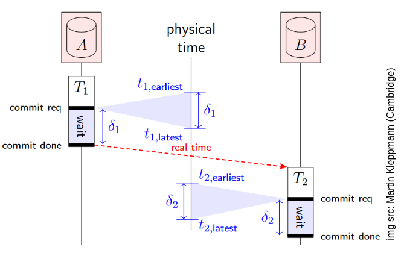

- TrueTime clock returns _[t_earliest, t_latest]_, where **true physical time** lie within
- On commit, wait for _delta_i = t_i_latest - t_i_earliest_ before committing and releasing locks, and assign _t_latest_
  for Txn _Ti_

Determing clock uncertainty in TrueTime

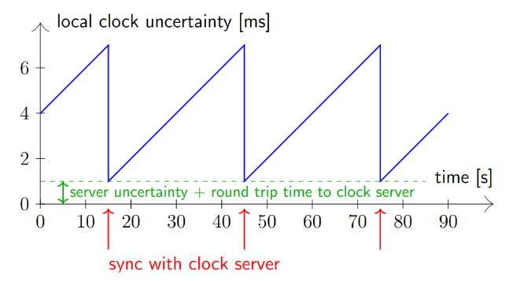

- Clock server with **atomic clock/GPS receiver** in each DC
- Each node syncs its **quartz clock** with a server every 30 sec (max. 200ppm drift between syncs)

### Other geo-distributed transaction systems

Strong consistency and serializability

- CockroachDB
- Calvin
- OceanVista
- Megastore
- Spanner
- FaunaDB
- SLOG
- FoundationDB

### Rack-scale solutions using fast interconnects

Distributed transactions can scale

- With low-latency high-bandwidth network interconnects using RDMA
- Oracle's RAC and Exadata
